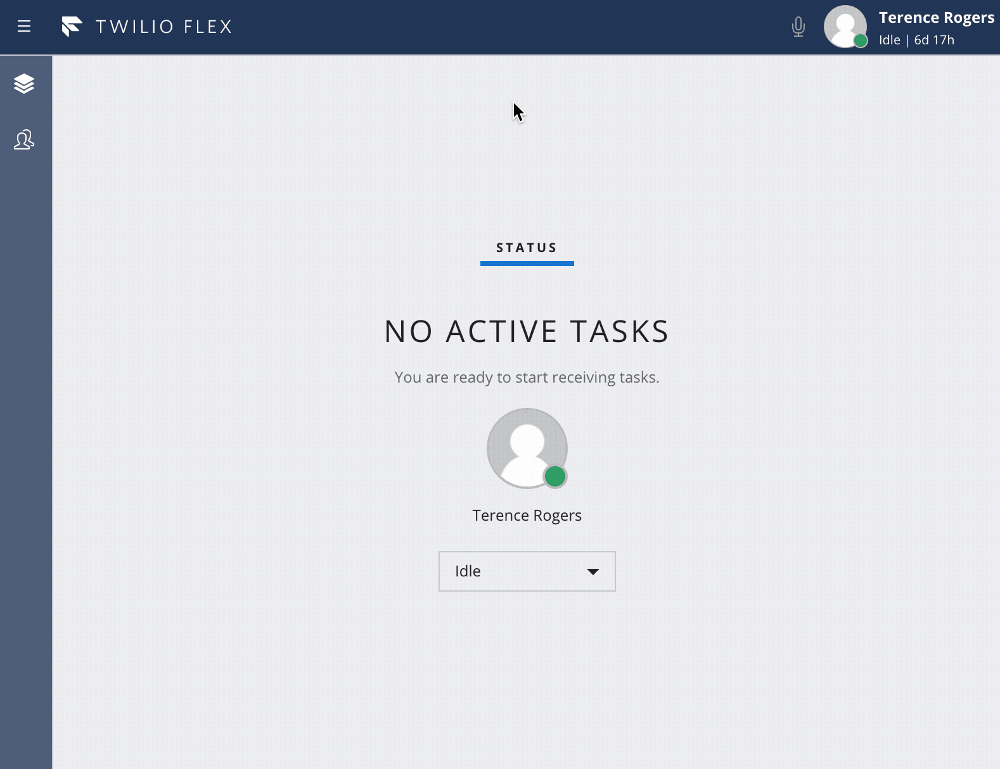

# Flex Plugin: External Conference & Warm Transfer

## Flex UI Version Requirements
**Minimum Flex UI version:**
* 1.10.0

**Tested Flex UI versions:**
* 1.10.0
* 1.11.1

## Flex Plugin documentation

Twilio Flex Plugins allow you to customize the apperance and behavior of [Twilio Flex](https://www.twilio.com/flex). If you want to learn more about the capabilities and how to use the API, check out our [Flex documentation](https://www.twilio.com/docs/flex).

## Overview

This plugin gives workers the ability to add an external participant to an inbound call. Participant controls such as Hold Participant and Remove Participant work properly for each conference participant. After adding an external participant to the call, the worker can drop and the conference will continue with the remaining participants.

This workflow will allow workers to conference in external parties and perform a warm transfer by introducing the customer to the external party before disconnecting from the call.

## Twilio Functions

### Environment Variables
The Twilio Functions this plugin depends on require `ACCOUNT_SID` and `AUTH_TOKEN` as environment variables in the context object. Perform the following steps to ensure these variables are available to your functions.

1. In your Twilio Console, navigate to Runtime -> Functions -> [Configure](https://www.twilio.com/console/runtime/functions/configure)
2. Make sure the box `Enable Account_SID and AUTH_TOKEN` is checked
3. If you had to check it, click the `Save` button at the bottom of the page

### Node Package Dependencies
There are a couple Node packages these Functions depend on. Perform the following steps to ensure these packages are available to your Functions.

1. In your Twilio Console, navigate to Runtime -> Functions -> [Configure](https://www.twilio.com/console/runtime/functions/configure)
2. Under **Dependencies**, add the following packages. The version can be left blank, just fill in the name:
    * node-fetch
    * js-base64
3. If enabled, click the `Save` button at the bottom of the page

### Creating the Functions
Please follow these steps for each file in the `/functions` directory before attempting to run this plugin. All Twilio Functions must be deployed prior to running the plugin or certain capabilities will not work.

1. In your code editor, select a function file in the `/functions` directory
2. Copy the file name as that will be the function name and path
3. In your Twilio Console, navigate to Runtime -> [Functions](https://www.twilio.com/console/runtime/functions/manage) 
4. Click the red plus sign to add a new Function
5. Click the `Blank` template and click `Create`
6. For the `Function Name` and `Path`, paste the Function file name you copied in step 2
7. Uncheck the `Access Control` box labeled `Check for valid Twilio signature`
    * Each Function is built to validate the Flex user token before processing the request, so they will still be secured
    * If this box is left checked, the Functions cannot be called from the Flex UI
8. In your code editor, copy all of the code in the selected file
9. In the Twilio Console, paste the code you just copied into the `Code` text area
10. Click the `Save` button at the bottom of the page
11. Continue with the next file in the `/functions` directory until all Functions have been created

### More Info
Feel free to reference our [Twilio Function](https://www.twilio.com/docs/runtime/functions) documentation for more details on Functions and how they work.

---
### **BETA NOTICE**

>Twilio Functions is currently available as a beta release. Some features are not yet implemented and others may be changed before the product is declared as Generally Available. Beta products are not covered by a Twilio SLA.

See [this article for more information](https://support.twilio.com/hc/en-us/articles/115002413087-Twilio-Beta-product-support?_ga=2.26835069.1957551946.1560788968-58383505.1547509695) on beta product support.

---
## Flex Plugin

### Setup

Make sure you have [Node.js](https://nodejs.org) as well as [`npm`](https://npmjs.com) installed.

Afterwards install the dependencies by running `npm install`:

```bash
cd 

# If you use npm
npm install
```

### Development

In order to develop locally, you can use the Webpack Dev Server by running:

```bash
npm start
```

This will automatically start up the Webpack Dev Server and open the browser for you. Your app will run on `http://localhost:8080`. If you want to change that you can do this by setting the `PORT` environment variable:

```bash
PORT=3000 npm start
```

When you make changes to your code, the browser window will be automatically refreshed.

### Deploy

Once you are happy with your plugin, you have to bundle it, in order to deply it to Twilio Flex.

Run the following command to start the bundling:

```bash
npm run build
```

Afterwards, you'll find in your project a `build/` folder that contains a file with the name of your plugin project. For example `plugin-example.js`. Take this file and upload it into the Assets part of your Twilio Runtime.

Note: Common packages like `React`, `ReactDOM`, `Redux` and `ReactRedux` are not bundled with the build because they are treated as external dependencies so the plugin will depend on Flex which would provide them globally.